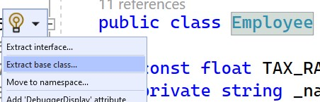
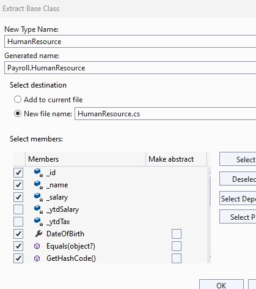

## Overview
We have already experienced some inheritance by overriding *Equals, GetHashCode & ToString*.  Now, we will define a new inheritance class hierarchy.

| | |
| --------- | --------------------------- |
| Exercise Folder | Inheritance |
| Builds On | Collections |
| Time to complete | 45 minutes |

---

## Success Criteria
Your solution should:
- Extract common properties into `HumanResource` base class (Name, Id, DateOfBirth, Address properties)
- Implement `Contractor` class inheriting from HumanResource with PayRate property
- Implement correct pay calculation: Contractor pay = hours * PayRate (no tax withholding)
- Employee still calculates pay with tax (salary / 26)
- Update Organization to manage both Employee and Contractor objects

## Where to find the solution
See [solutions/Inheritance](../../solutions/Inheritance)
## Instructions
Continue with the previous lab.

The customer would like our payroll system to also support contractors.  The rules for computing the pay for a contractor are different.  The contractor doesn't have a salary, but an hourly rate.  The contractor's pay also doesn't withhold any tax.

For this lab we will create a *Contractor* class, and since much of the contractor is identical to *Employee*, we will capture the commonality in a base class, *HumanResource*

### Steps
1. Use the *Quick Actions & Refactorings* tool to *Extract Base class* '
    - Nothing magic about the tool - you can do this by simple cut & paste 
	
	
1. Name the base class *HumanResource*. Select the fields, properties and methods to move to the base class
    - name field & property
    - id field & property
    - HomeAddress
    - Date of Birth
    - Equals, GetHashCode
1. Pay is common to both contractors and employees, but the implementation differs.  Add ```public virtual float Pay() {return 0;}``` to *HumanResource*
    - the class should be abstract also
1. Create a new class named *Contractor* that inherits from *HumanResource*
1. Add an auto property, *PayRate*
1. Override *Pay* to calculate the pay as 40 * PayRate

#### Organization
In order for organizations to work with employees and contractors, the references in organization need to change to *HumanResource*
1. Change all references to *Employee* to *HumanResource* in Organization
1. In *Program.cs*, create some contractors and Hire them

--- 

