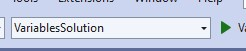

## Overview
This lab demostrates the basic syntax of C# by declaring and initializing variables of different types.

| | |
| --------- | --------------------------- |
| Exercise Folder | Syntax |
| Builds On | None |
| Time to complete | 30 minutes
## Success Criteria
Your solution should:
- Declare variables of required types: int, uint, long, float, double, char, bool
- Initialize each variable with appropriate literal values
- Display variable values using interpolated strings and Console.WriteLine
- Show correct formatting and types in output

## Where to find the solution
See [solutions/Syntax](../../solutions/Syntax)
---
## Instructions
1. Either create a new console application in your current solution or continue with your last project
1. In *Program.cs*, Declare variables of these types:
    - int, uint, long
    - float, double
    - char, bool
1. Initialize the variables with literals
1. Using interpolated strings ($"") and ```Console.WriteLine```, display the variable's values

### Example
```csharp
// Symbox syntax
// A symbol consists of any number of letters, digits, or underscores, 
// but must start with a letter or underscore.
// Also, case-sensitive.
int myvariable;
// is different from
int MyVariable;
//int 9lives; // invalid

// declaring (or defining) a variable is
// type name;
int myInt;
// cannot have duplicate declarations
//int myInt; <-- invalid, already declared

// assignment vs initialization

// assignment - giving a variable a value after it is declared
myInt = 5;
// initialization - giving a variable a value when it is declared
int myInt2 = 5;

// type strictness
// once a variable is declared with a type, it cannot be changed
//myInt = "hello"; // invalid - myInt is an int, not a string

// variables can be reassigned
myInt = 10; // previously 5

// literal values
// a literal value is a value that is written directly in the code
// 5 is a literal value
// "hello" is a literal value

// notation for literal types
// 5 is an int
// 5.0 is a double
// 5f is a float
// 5L is a long
// 5u is a uint
// 5m is a decimal

int wholeNum = -20;
long bigNum = 22_678_123; // underscores are ignored, used for readability
uint positive = 223;
var pif = 3.14f;
double pid = 3.141567896;
//decimal money = 0;

// char is a single character - literals are in single quotes
char c = 'c';
// string is a sequence of characters - literals are in double quotes
string text = "This is a string";

Console.WriteLine($@"I wrote a program in C# and here is some data:
wholeNum: {wholeNum},
bigNum: {bigNum},
positive: {positive},
pif: {pif},
pid: {pid},
c: {c},
and text: {text}.
Have a nice day!");

Console.WriteLine($"""
   Oh, and here is the same thing, but with a raw string:
   wholeNum: {wholeNum},
   bigNum: {bigNum},
   positive: {positive},
   pif: {pif},
   pid: {pid},
   c: {c},
   and text: {text}.
   Have a nice day!
   """);

// Console is a class in the System namespace
// WriteLine is a method in the Console class
// WriteLine writes a line of text to the console
// $ is an interpolated string
// {} is a placeholder for a variable
// \n is a newline character
// \t is a tab character
// if the parameter is not a string, it is converted to a string
Console.WriteLine($"Hello, World! {wholeNum} (extra newline)\n");
```

 
 >Note (Visual Studio):  If your solution has multiple projects, the *startup project* will execute when you run.  To select the startup project, look a the dropdown list in the toolbar:
 
 ---

>Note (VS Code): The *C# Dev Kit* extension has a feature that will run the current project.  To use it, right-click on the project in the *Solution Explorer* and select *Run Project* from the context menu.  
 
